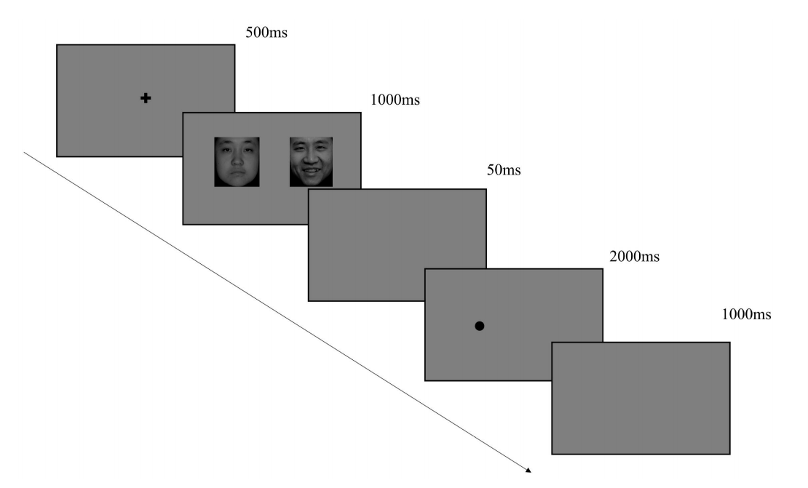

# Dotprobetask_YawenXU

# README: Attentional Bias Experiment using MATLAB

## Overview
This MATLAB code is designed to conduct an attentional bias experiment using a dot-probe paradigm. The experiment is structured to investigate the spatial distribution of attentional resources and to assess attentional biases in individuals with emotional disorders.

## Requirements
- MATLAB 2018a or later
- Computer with screen resolution of 1920x1080 pixels
- Participants seated 60 cm away from the screen

## Setup
The experiment involves presenting two stimulus areas with gray-scale images of size 260x300 pixels, subtending a visual angle of 8.8°x10.1°. Participants are required to respond to the location of a probe dot that appears after a pair of emotional faces.

## Experiment Flow
1. Participants focus on a central fixation cross.
2. A pair of emotional faces appears symmetrically on the left and right sides of the screen.
3. After the faces disappear, a probe dot appears in the location of one of the faces.
4. Participants must respond as quickly and accurately as possible to the location of the probe dot.
5. If no response is given within 2000 milliseconds, a 1000ms blank screen appears before the next trial.

## Code Structure
- `main_experiment.m`: The main script to run the experiment.
- `stimulus_presentation.m`: Functions to present the stimuli.
- `response_recording.m`: Functions to record participant responses and reaction times.
- `probe_size_adjustment.m`: Functions to adjust the size of the probe dot based on participant performance.
- `data_analysis.m`: Functions to analyze the collected data.

## Running the Experiment
To run the experiment, simply execute the `main_experiment.m` script in MATLAB. Ensure that all the supporting functions are in the same directory or in the MATLAB path.

## Flowchart of the Experiment Process

Below is a flowchart illustrating the experiment process:

## Notes
- The size of the probe dot is adaptively adjusted based on participant performance, starting with a larger size during practice.
- The experiment consists of three blocks with different face pairings: positive-neutral, neutral-neutral, and negative-neutral.
- Each block contains 40 trials, with balanced image positions and probe dot locations.

## License
This code is for academic and research purposes only. Please respect the terms of use and cite the original authors when using this code in your research.

## Authors
- Original Paradigm: MacLeod et al. (1986), Hua et al. (2016), Nie et al. (2015)
- MATLAB Implementation: Liu et al. (2019)

## Contact
For any questions or issues regarding the code, please contact [M202375413@hust.edu.cn].

